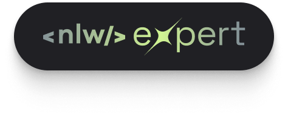
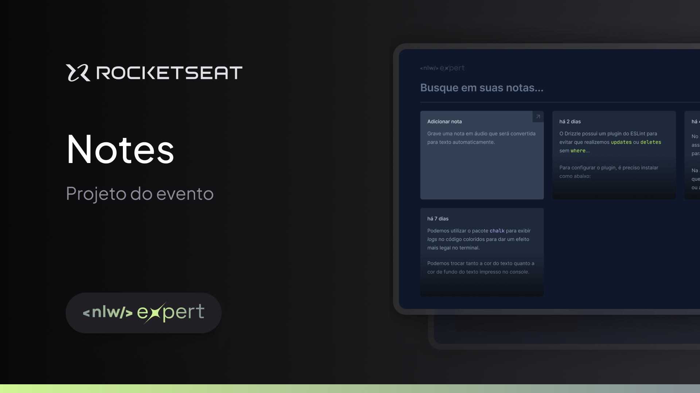

<p align="center">
  
  <br><br>
</p>

<h1 align="center">Suas notas em um lugar simples e eficiente</h1> 
<div align="center">
<br><br>
<div>
  
</div>
<br><br>
</div>
<br><br>

## 📑 Índice

- [Sobre o Projeto](#-sobre-o-projeto)
- [Tecnologias utilizadas](#-tecnologias-utilizadas)
- [Executar na sua máquina](#-executar-na-sua-máquina)
- [Licença](#-licença)
  <br><br>

## 💡 Sobre o Projeto

O **Notes** é uma aplicação Web para auxiliar na criação de notas de uma maneira muito mais eficiente que o normal. Esta aplicação oferece ao usuário a possibilidade de criar notas sem a necessidade de digitar, usando apenas a voz para registrar qualquer tipo de mensagem.

Essa aplicação foi realizada durante a Next **Level Week Expert**, projeto da [Rocketseat](https://rocketseat.com.br/).

<br>

## 🚀 Tecnologias utilizadas

O projeto foi desenvolvido utilizando as seguintes tecnologias:

- ReactJS
- TypeScript
- Tailwind CSS
  <br><br>

## 📥 Executar na sua máquina

- Clonar Repositório: `git clone https://github.com/chrisdcdev/nlw-expert-notes`

```sh
  # Instalando as dependências do projeto.
  $ yarn # ou npm install
  # Inicie a aplicação web
  $ yarn dev # ou npm run dev

```

<br><br>

## 📕 Licença

Todos os arquivos incluídos aqui, incluindo este _README_, estão sob [Licença MIT](./LICENSE).<br>
Criado com ❤ por [Christian Castro](https://github.com/ccastro01)
